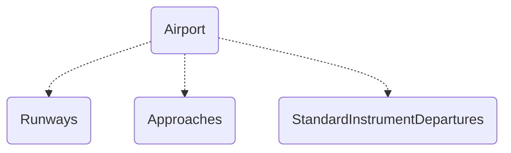

*work in progress and target on ver. 20 of the specification*

# Overview

While the `ARINC424` format describes entities (*or records*) with 132-byte fixed-length string, this library creates a database object model at load time via building entities using reflection. Most terms are converted according to the specification into associated enums or numeric values on the fly.

In addition, relationships between entities are determined after the building stage.

In practice, this allows you to explore and manipulate the tree-like representation of `ARINC424` database.
